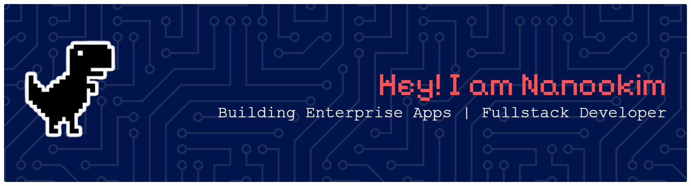

 

 

<table border="0" cellpadding="0" cellspacing="0" align="center">
  <tr>
    <td width="50%" align="right">
      
    </td>
    <td width="50%" align="left">
      
    </td>
  </tr>
</table>

 

<h3><kbd> 🐍 CONTRIBUTION_SNAKE_GAME </kbd></h3>

<i>Ular ini akan memakan riwayat kontribusimu setiap hari secara otomatis.</i>

  

  

<h3><kbd> 💻 TECHNICAL_CORE_EXHIBIT </kbd></h3>

<table border="0" align="center" width="100%">
  <tr>
    <td align="left" width="50%" valign="top">
      <h4></h4>
      
Arsitektur server-side dengan framework PHP modern.

      
    </td>
    <td align="left" width="50%" valign="top">
      <h4></h4>
      
Aplikasi mobile cross-platform dan interface modern.

      
    </td>
  </tr>
  <tr>
    <td align="left" width="50%" valign="top">
       
      <h4></h4>
      
    </td>
    <td align="left" width="50%" valign="top">
       
      <h4></h4>
      
    </td>
  </tr>
</table>

  

 

  
  

