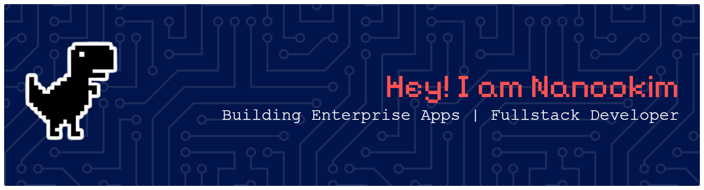

  <!-- Header Banner -->
  

    

  <!-- Dynamic Typing Header -->
  

  

    ⚡ <b>Crafting scalable backend architectures & seamless cross-platform mobile apps.</b>
  

  <!-- Quick Info Badges -->
  

    
    
    
  

   

  <!-- GitHub Stats Section -->
  <table border="0" cellpadding="0" cellspacing="0" align="center" width="100%">
    <tr>
      <td width="50%" align="center" valign="middle">
        
      </td>
      <td width="50%" align="center" valign="middle">
        
      </td>
    </tr>
  </table>

  <!-- Streak Stats -->
  

    
  

   

  <!-- Snake Contribution Game -->
  <h3><kbd> 🐍 CONTRIBUTION_SNAKE_GAME </kbd></h3>
  
<i>Automated daily commit eating snake animation</i>

  

    
  
    

  <!-- Tech Stack Section -->
  <h3><kbd> 💻 TECHNICAL_CORE_EXHIBIT </kbd></h3>

  <table border="0" align="center" width="100%">
    <tr>
      <td align="left" width="50%" valign="top">
        <h4></h4>
        
Robust server-side architecture and API development.

        
      </td>
      <td align="left" width="50%" valign="top">
        <h4></h4>
        
Cross-platform mobile apps & modern frontend interfaces.

        
      </td>
    </tr>
    <tr>
      <td align="left" width="50%" valign="top">
         
        <h4></h4>
        
CI/CD, version control, and development workflows.

        
      </td>
      <td align="left" width="50%" valign="top">
         
        <h4></h4>
        
High-performance systems and caching strategies.

        
      </td>
    </tr>
  </table>

    
  
    

  <!-- Connect Section -->
  <h3>🌐 CONNECT_WITH_ME</h3>
   

  

    
    
    
  

   

  <!-- Profile Visitor Counter -->
  

    
  

